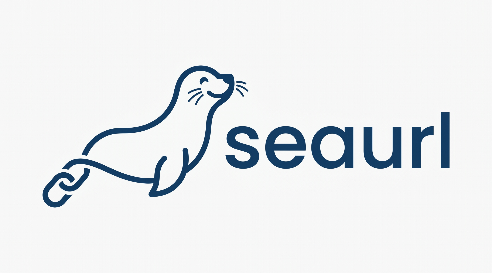

<p align="center">
  
</p>

# SeaURL

SeaURL is a simple and fast URL shortener service written in Go.

## 🚀 How to Run

The project is configured for easy deployment using Docker and Docker Compose.

### Prerequisites
- [Docker](https://docs.docker.com/get-docker/) and [Docker Compose](https://docs.docker.com/compose/install/) installed on your machine.

### Quick Start

1. **Clone the repository**:
   ```bash
   git clone https://github.com/dmi3midd/seaurl
   cd seaurl
   ```

2. **Run the application using Docker:**
   ```bash
   docker compose up -d --build
   ```

The server will be up and running at: `http://localhost:2900`

---

## 📡 API Documentation

### 1. Create a Short URL (Alias)
Saves a long URL to the database and generates a unique short identifier (alias) for it.

- **Method:** `POST`
- **Endpoint:** `/`
- **Content-Type:** `application/json`

**Request Body:**
```json
{
  "url": "https://www.very-long-url-example.com/some/path/to/page"
}
```

**Example Request (cURL):**
```bash
curl -X POST http://localhost:2900/ \
     -H "Content-Type: application/json" \
     -d '{"url": "https://www.very-long-url-example.com/some/path/to/page"}'
```

**Successful Response (200 OK):**
```json
{
  "id": "abc123xy",
  "url": "https://www.very-long-url-example.com/some/path/to/page",
  "alias": "QWERTYUI"
}
```

---

### 2. Use a Short URL (Redirect)
Takes an alias and redirects the user to the original saved URL.

- **Method:** `GET`
- **Endpoint:** `/{alias}`

**Example Usage:**
Simply open the link in your browser:
`http://localhost:2900/QWERTYUI`

Or via terminal (to see the HTTP redirect headers):
```bash
curl -i http://localhost:2900/QWERTYUI
```

**Response:**
The server returns an HTTP status of `301 Moved Permanently` (or `303 See Other`) and includes the original link in the `Location` header, forcing the browser to instantly navigate to the target page.

### Will be improved in the future with more features...